## 1.1.1
a) Variaveis: cada um dos quadrados da grid. 
Dominio: Para cada uma delas o dominio é de 1 a n 
Constraints:
- todas as linhas precisam de que os seus elementos sejam diferentes.
- todas as colunas precisam de que os seus elementos sejam diferentes.

### Solução do stor: 
Variaveis de celula -> X = { x_{ij} | i <= i <= n, 1 <= j <= n } 
Dominio: D_x = {k | 1 <= k <= n } 

Constraints:
- $V_i$ alldiff($x_{i1}$, $x_{i2}$, ..., $x_{in}$)
- $V_j$ alldiff($x_{j1}$, $x_{j2}$, ..., $x_{jn}$)

b) 
Variaveis: cada um dos quadrados em cada um dos squares. 
Dominio: 1 a n 
Constraints:  
- Separadamente os Latin squares têm de cumprir as constraints de a).
- Todos os pares presentes no orthogonal square precisam de ser diferentes.

### Solução do stor:
Variaveis: 
A = { $a_{ij}$ | 1 <= i <= n; 1 <= j <= n } 
B = { $b_{ij}$ | 1 <= i <= n; 1 <= j <= n } 

Domain: 
$D_A$ = $D_B$ = { k | 1 <= k <= n } 
$D_X$ = { (l, m) | 1 <= l <= n, 1 <= m <= n } 

Constraints: 
- alldiff(X)

## 1.1.2

Variaveis: Valores da matriz 
Dominio: -9 a 9 
Constraints:
- (x,y) = 0 && x == y
- (x,y) = -(y,x) && x != y

### Solução do stor:
Variaveis: A = { $x_{ij}$ | 1 <= i <= 3 , 1 <= j <= 3 } 

Domain: $D_A$ = [-9, 9] 

Constraints:
- $x_{ij} = -x_{ji}
- D($x_{11}$) = D($x_{22}$) = D($x_{33}$) = {0}

# 1.1.3

Variaveis: cada uma das cells 
Dominio: 1..(3n^2 - 3n + 1) 
Constraints:
- alldifferent para todas a variaveis
- a soma de todas as linhas é igual a M
- a soma de todas as diagonais é igual a M

### Solução do stor:

Variaveis: [a, s] 

Domain: { K | 1 <= k <= 19 }

Constraints:
- alldiff(X)
- a + b + c = d + e + f + g = ... = 38
- a + d + h = b + c + i + m = ... = 38
- c + g + l = b + f + k + p = ... = 38

# 1.2.1

| Edges | Domain Change | New edges |
| ----- | ------------- | --------- |
| $x_0, x_1$ | $x_0$ = {3,4,7} | Não atualiza por tar em processo |
| $x_1, x_0$ | $x_1$ = {2,4,6} | ($x_0, x_1$)
| $x_0, x_2$ | ---------- | --------- |
| $x_2, x_0$ | $x_2$ = {3,4,7} | ($x_0, x_1$) |
| $x_0, x_3$ | -------- | ------- |
| $x_3, x_0$ | -------- | ------- |
| $x_0, x_1$ | -------- | ------- |
| $x_0, x_2$ | -------- | ------- |

$D_{x_0}$ = {3,4,7}
$D_{x_1}$ = {2,4,6}
$D_{x_2}$ = {3,4,7}
$D_{x_3}$ = {6,7,8}

# 1.2.5

## a)

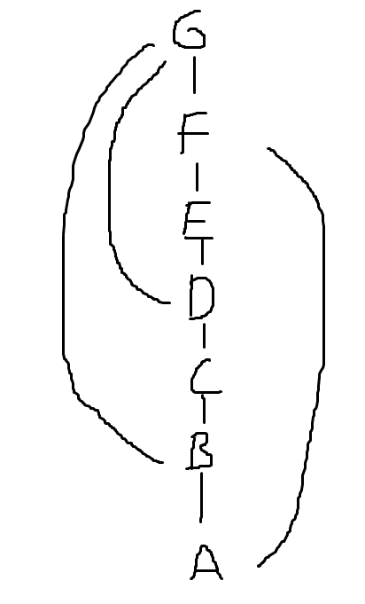

w(A) = 0 
w(B) = 1 
w(C) = 1 
w(D) = 1 
w(E) = 1 
w(F) = 2 
w(G) = 3 
width graph = 3

## b)

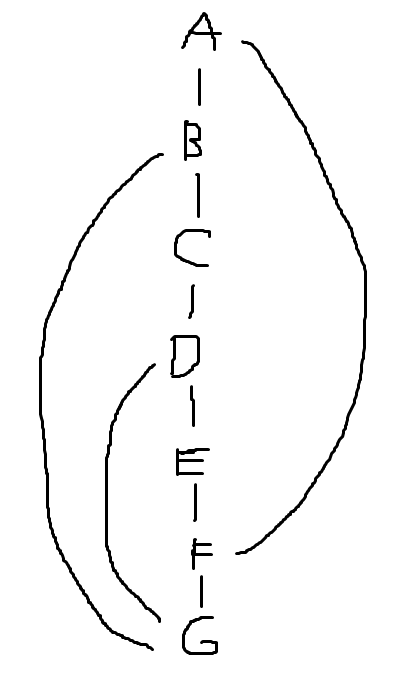

w(G) = 0 
w(F) = 1 
w(E) = 1 
w(D) = 2 
w(C) = 1 
w(B) = 2 
w(A) = 2 
width graph = 2

 

# 1.2.6

## a) 

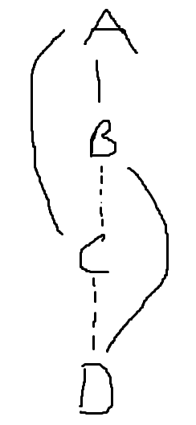

w(D) = 0 
w(C) = 1 
w(B) = 2 
w(A) = 2 
width graph = 2

## b)

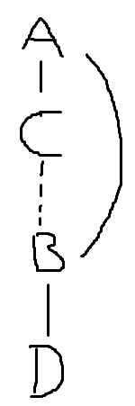

w(D) = 0 
w(B) = 1 
w(C) = 1 
w(A) = 2 
width graph = 2

# 1.2.7

## a)

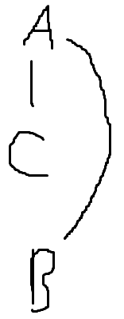

w(B) = 0 
w(C) = 0 
w(A) = 2 
width graph = 2

## b)

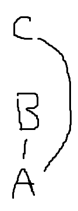

w(A) = 0 
w(B) = 1 
w(C) = 1 
width graph = 1

## c)

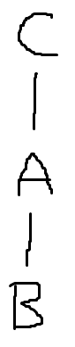

w(B) = 0 
w(A) = 1 
w(C) = 1 
width graph = 1

## d)

a), b), c) :
| Nodes | Changes |
| ----- | ------- |
| A     | -       |
| B     | -       |
| C     | -       |

Nada vai mudar para nenhum dos casos 

## e)

a)
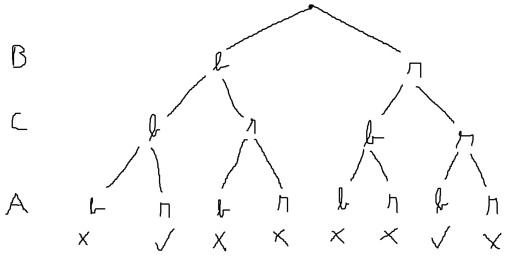

b)
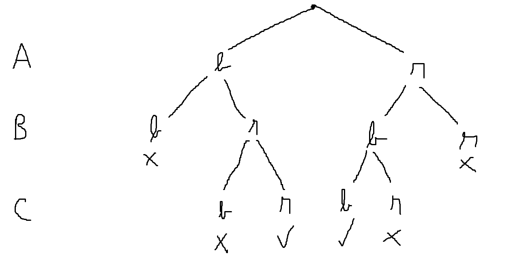

c)
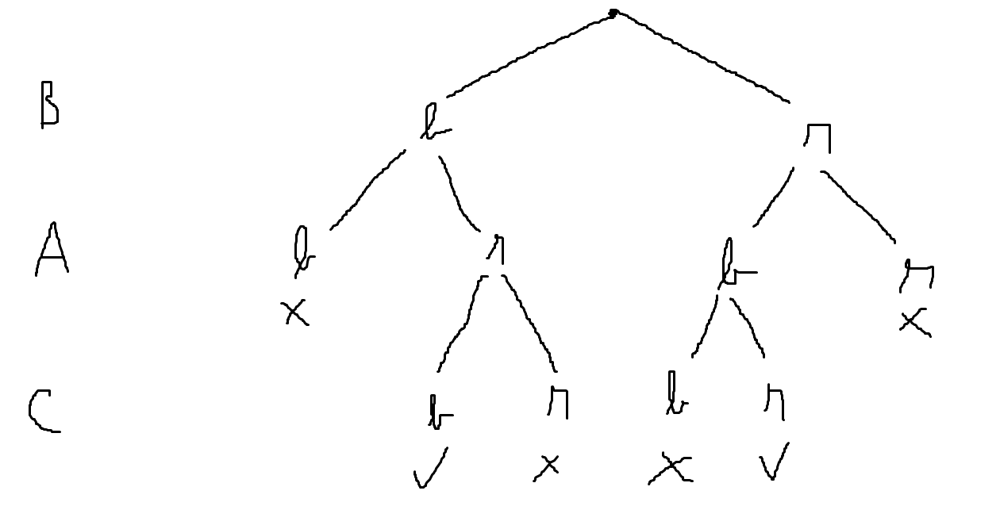

Quando se deixa o nó com mais conexões para o fim, as procuras são mais fundas.

## f)

Não mudam nada em relação ao width normal

## g)

Path consistency vai criar uma nova constraint: B = C.
Isto faz com que a arvore da ordem a), vá também ter cortes mais cedo.

# 1.2.8

## a)

| Nodes | Domian Changes |
| ----- | -------------- |
| E | $D_D$ = {g,b} |
| D | - |
| C | $D_B$ = {r,g} |
| B | - |
| A | - |

## b)

| Nodes | Domain Changes | Constraints | Edge |
| ----- | -------------- | ----------- | ---- |
| E | $D_D$ = {g,b} | - | - |
| D | - | $R_{BC}$ = {(r, b)} | - |
| C | $D_B$ = {r} | - | - |
| B | - | - | - |
| A | - | - | - |

 

# 1.2.9

| Nodes | Domain Changes |
| ----- | -------------- |
| $x_4$ | $D_3$ = {white, blue} |
| $x_3$ | $D_1$ = {white} |
| $x_2$ | --- |
| $x_1$ | --- |

It is backtrack-free because whichever value selected for $x_1$ will allow us to reach a decision without backtracking. 
It is not full arc consistent because, for example, three are values in $x_2$ that don't respect $R_{1,2}$, for example, green.

 

# 1.2.10

## a)

É path-consistent porque independentemente do valor escolhido para $x$ é possível escolher um valor para $y$ que satisfaz $x < y$. E para esse mesmo valor de $y$ é possível escolher um valor de $z$ que satisfaz $y < z$. E independentement do valor escolhido para $z$, a constraint $x < z$ vai estar sempre satisfeita. 

Demonstração: 
$0 <= x <= 4$ Logo, 
$x < y <= 5$, para todos os valores de que $x$ pode assumir, há sempre um valor de $y$ que cumpre $x < y$ 
$y < z <= 10$, o valor mais alto que y pode ter é 5, ou seja há sempre algum valor de $z$ que cumpre $y < z$ 
Como $x \in [0, 4]$ e $z \in [5, 10]$, por isso a constraint $x < z$ também está sempre satisfeita.

 

## b) e c)

A melhor maneira de mostrar que não é directional path-consistent é com um contra-exemplo por isso vou misturar o b) e o c).

Ao escolher $x$ = 4 e $z$ = 5 cumpria o constraint $x < z$ e ao escolher $y$ = 1 também cumpro o constraint $y < z$, seguindo a ordem dada. No entanto, a constraint $x < y$ não é cumprida para estes valores de $x, y, z$. Logo a network não é path consistent para a ordem $x, z, y$.

 

# 1.3.1

Backtracking:

$X_A$ = r
- $X_B$ = g
  - $X_C$ = b
    - $X_D$ = r
      - $X_E$ = g
        - $X_F$ = b
          - $X_G$ = ~~r~~, ~~b~~
        - $X_F$ = g
          - $X_G$ = ~~r~~, ~~b~~
      - $X_E$ = y

## a)

Node G

## b)

Node F

## c)

Node E

## d)

E = y True

## e)

Gashnig's Backjumping

A = r latest = {}
- B = g latest = {}
  - C = b latest = {}
    - D = r latest = {}
      - E = g latest = {}
        - F = b latest = {}
          - G = ~~r~~, ~~b~~ latest = C porque corre de cima para baixo e C elimina o blue do dominio, ficando assim vazio. Antes o A removeu o red.
  - C = {} backtrack
- B = y latest = {}
  - C = b latest = {}
    - D = r latest = {}
      - E = g latest = {}
        - F = b latest = {}
          - G = ~~r~~, ~~b~~ latest = C
  - C = {} backtrack
- B = {} backtrack

A = b latest = {}
- B = g latest = {}
  - C = b latest = {}
    - D = r latest = {}
      - E = g latest = {}
        - F = b latest = {}
          - G = ~~r~~, ~~b~~ latest = D
    - D = g latest = {}
      - E = g latest = {}
        - F = b latest = {}
          - G = r COMPLETED 

---

Graph-based backjumping

Primeiro aplica-se os induced parents.

A = r Induced = {}
- B = g Induced = {}
  - C = b Induced = {}
    - D = r Induced = {}
      - E = g Induced = {}
        - F = b Induced = {}
          - G = ~~r~~, ~~b~~ Induced = {A, C, D, E} JUMP TO E
      - E = y Induced = {}
        - F = Induced = {}
          - G = ~~r~~, ~~b~~ Induced = {A, C, D, E} JUMP TO E
      - E não tem valores por isso salta para o próximo induced: Induced = {A, C, D}, ou seja, para D
    - D = g Induced = {}
      - E = g Induced = {}
        - F = b Induced = {}
          - G ~~r~~, ~~b~~ Induced = {A,C,D,E}
      - E = y Induced = {}
        - F = b Induced = {}
          - G ~~r~~, ~~b~~ Induced = {A,C,D,E}
      - E não tem valores por isso salta para o próximo induced: Induced = {A, C, D}, ou seja para D
    - D Também não tem valores por isso vai para o próximo, ou seja C
  - C Que também não tem e vai para A

A = b Induced = {}
- B = g Induced = {}
  - C = b Induced = {}
    - D = r Induced = {}
      - E = g Induced = {}
        - F = b Induced = {}
          - G = ~~r~~, ~~b~~ Induced = {A,C,D,E}
      - E = y Induced = {}
        - F = b Induced = {}
          - G = ~~r~~, ~~b~~ Induced = {A,C,D,E}
      - E não tem valores então vai para o próximo, Induced = {A,C,D}
    - D = g
      - E = g
        - F = b
          - G = r

---

Conflict-based 

A = r JUMP = {}
- B = g JUMP = {}
  - C = b JUMP = {}
    - D = r JUMP = {}
      - E = g JUMP = {}
        - F = b JUMP = {}
          - G Nao tem valores possíveis JUMP = {A, C}
  - C Não tem valores possíveis JUMP = {A}

A = b JUMP = {}
- B = g JUMP = {}
  - C = b JUMP = {}
    - D = r JUMP = {}
      - E = g JUMP = {}
        - F = b JUMP = {}
          - G Não tem valores JUMP = {C, D}
    - D = g JUMP = {}
      - E = g JUMP = {}
        - F = g JUMP = {}
          - G = r JUMP = {}

## e)

G

## f)
        
C

## g)

B

## h)

True

## i)

G

## j)

E

## k)

F

## l)

True

## m)

G

## n)

False

## o)

E

## p)

False

## q)

D

## r)

True

## s)

G

## t)

C

## u)

A

## v)

False

 

# 1.3.3

## a)

O par $x_1$ e $x_4$ é um no-good. Nesse caso podemos fazer a constraint `not (x1 == 1 /\ x4 == 2)`

## b)

It would fail at $x_4$ and wouldn't keep going.

# 1.3.4

$x_1$ = 1
- $x_2$ = 1
  - $x_3$ = ~~1~~, ~~2~~ -> No-good: ($x_1$ = 1, $x_2$ = 1)
- $x_2$ = 2
  - $x_3$ = ~~1~~, ~~2~~ -> No-good: ($x_1$ = 1, $x_2$ = 2)
- $x_2$ = 3
  - $x_3$ = ~~1~~, ~~2~~ -> No-good: ($x_1$ = 1, $x_2$ = 3)

$x_1$ = 2
- $x_2$ = 1
  - $x_3$ = ~~1~~, ~~2~~ -> No-good: ($x_1$ = 2, $x_2$ = 1)
- $x_2$ = 2
  - $x_3$ = 1
    - $x_4$ = ~~1~~, 2
      - $x_5$ = ~~1~~, ~~2~~ -> Leaf dead end -> No-good: ($x_3$ = 1, $x_4$ = 2)
    - $x_4$ não tem mais valores, então temos internal dead end -> No-good: ($x_3$ = 1)
- $x_2$ = 3
  - $x_3$ = 1 -> Não continua porque temos o no-good $x_3$ = 1, ou seja adicionamos ($x_1$ = 2, $x_2$ = 3), aos no-goods
  - $x_3$ = 2 -> Não continua porque temos o no-good ($x_1$ = 2, $x_2$ = 3)

$x_1$ = 3
- Iriamos repetir a coisa toda // TODO TENTA FAZER ESTA BOMBA EM CASA

 

# 1.4.1

## a)

Se metermos $x_1$ = True a probabilidade de F ser satisfeito é 100%, se metermos $x_1$ = False a probabilidade de F ser satisfeito é $\dfrac{1}{2^{99}}$

Então P(F ser satisfeito) = P($x_1$ = T) + P($x_1$ = F /\ resto = F) = $\dfrac{1}{2} + \dfrac{1}{2} \times \dfrac{1}{2^{99}}$

## b)

1 flip -> Não confirmado pelo stor, mas deve bué ser lol

 

# 1.4.2

## a)

É possível sim, eventualmente todas as hipoteses vão ser consideradas e vai acabar por resolver o problema.

## b)

(!P V !Q), (P V Q)

Se começarmos com P = False e Q = False, ao fazermos flip simultaneamente vai haver sempre uma clausua a falhar.

 

# 1.4.3

A = False 
B = False 
C = True 
D = False 

Choose: C = False 
Choose: A = True

 

# 1.5.2

## a)

Variables = {$X_1,X_2,X_3,X_4,X_5,X_6$} 
Domain $X_i | i \in \{1, ..., 6\}$ = {0,1,2} 
Constraints:
- $X_1 != X_4$
- $X_1 != X_3$
- $X_2 != X_3$
- $X_2 != X_4$
- $X_2 != X_5$
- $X_2 != X_6$
- ...
- $X_1$ < $X_4$
- $X_4$ < $X_3$

## b)

$X_1$ = 0
- $X_2$ = 0
  - $X_3$ = ~~0~~, 1
    - $X_4$ = ~~0~~, ~~1~~, ~~2~~
  - $X_3$ = 2
    - $X_4$ = ~~0~~, 1
      - $X_5$ = ~~0~~, ~~1~~, ~~2~~
    - $X_4$ = ~~2~~
  - $X_3$ = ~~0~~
- $X_2$ = 1

## c)

$X_1$ = 0 -> $D_3$ = {1,2}, $D_4$ = {1,2}
- $X_2$ = 0 -> $D_3$ = {1,2}, $D_5$ = {1,2}, $D_6$ = {1,2}
  - $X_3$ = 1 -> $D_4$ = {~~0~~}, it becomes empty because of the other constraint that $X_4$ < $X_3$
  - $X_3$ = 2 -> $D_4$ = {1}, $D_5$ = {1}, $D_6$ = {1}
    - $X_4$ = {~~0~~}
- $X_2$ = 1 -> $D_3$ = {2}, $D_5$ = $D_6$ = {0, 1}
  - $X_3$ = 2 -> $D_4$ = {1}, $D_5$ = $D_6$ = {0}
    - $X_4$ = 1
      - $X_5$ = 0
        - $X_6$ = 0

## d)

a = {$(X_1, X_3), (X_3, X_1), (X_1, X_4), (X_4, X_1), (X_2, X_3), (X_3, X_2), (X_2, X_5), (X_5, X_2), ...$}

| Id | Edge | New Domain | Back to Queue |
| -- | ---- | ---------- | ------------- |
| 1  | $(X_1, X_3)$ | --- | --- |
| 2  | $(X_3, X_1)$ | --- | --- |
| 3  | $(X_1, X_4)$ | $D_1$ = {0, 1} | $(X_3, X_1)$ |
| 4  | $(X_4, X_1)$ | $D_4$ = {1, 2} | $(X_1, X_4)$ |
| 5  | $(X_2, X_3)$ | - | - |
| 6  | $(X_3, X_2)$ | - | - |
| .. | | |
| 10 | | |

Final: 
$D_1$ = {0, 1} 
$D_4$ = {1, 2}

Dica do stor: Os valores que são adicionados à queue, vão ser um par em que o valor da direita é o valor que estava à esquerda no edge. Como mostra a tabela do exercicio.

## e)

$D_1$ = {0, 1} 
$D_2$ = {0, 1, 2} 
$D_3$ = {2} 
$D_4$ = {1} 
$D_5$ = {0, 1, 2} 
$D_6$ = {0, 1, 2} 

$X_1$ = 0
- $X_2$ = 0
  - $X_3$ = 2
    - $X_4$ = 1
      - $X_5$ = ~~0~~, ~~1~~, ~~2~~
- $X_2$ = 1
  - $X_3$ = 2
    - $X_4$ = 1
      - $X_5$ = 0
        - $X_6$ = 0

 

# 1.5.4

## a)

Variables = {S, E, N, D, M, O, R, Y, $X_1$, $X_2$, $X_3$, $X_4$} 
Domains:
- $D_i | i \in $ {S, .. Y} = 0..9 
- $D_j | i \in $ {$X_1$, .., $X_4$} 

Constraints:
- AllDiff(S, ..., Y) <- Não percebo porque é que tem de se fazer isto mas yah.
- D + E = Y + 10 * $X_1$
- N + R + $X_1$ = E + 10 * $X_2$
- E + O + $X_2$ = N + 10 * $X_3$
- S + M + $X_3$ = O + 10 * $X_4$
- M = $X_4$

 

# 1.5.5

## f)

$X_A$ = 1 $latest_A$ = {}
- $X_B$ = ~~1~~, .., ~~8~~ $latest_B$ = A -> JUMP

$X_A$ = 2 $latest_A$ = {}
- $X_B$ = 1 $latest_B$ = {}
  - $X_C$ = ~~1~~,..,~~8~~ $latest_C$ = B -> JUMP
- $X_B$ = ~~2~~,..,~~8~~ backtrack

$X_A$ = 3 $latest_A$ = {}
- $X_B$ = 1 $latest_B$ = {}
  - $X_C$ = ~~1~~,..,~~8~~ $latest_C$ = B -> JUMP
- $X_B$ = ~~2~~,..,~~8~~ backtrack

$X_A$ = 4 $latest_A$ = {}
- $X_B$ = ~~1~~, 2 $latest_B$ = {}
  - $X_C$ = 1 COMPLETED

## g)

A = 1 Induced = {}
- B= ~~1~~, .., ~~8~~ Induced = {A}

A = 2 Induced = {}
- B = 1 Induced = {}
  - C = ~~1~~, ..~~8~~ Induced = {B}
- B= ~~2~~, .. ~~8~~ Induced = {A}

A = 3 Induced = {}
- B = 1 Induced = {}
  - C = ~~1~~, .., ~~8~~ Induced = {B}
- B = ~~2~~, .., ~~8~~ Induced = {}

A = 4 Induced = {}
- B = ~~1~~, 2 Induced = {}
  - C = 1 Completed

# h)

A = 1 Jump = {}
- B = ~~1~~, .., ~~8~~ Jump = {A}

A = 2 Jump = {}
- B = 1 Jump = {}
  - C = ~~1~~, .., ~~8~~ Jump = {B}
- B = ~~2~~, .., ~~8~~ Jump = {A}

A = 3 Jump = {}
- B = 1 Jump = {}
  - C = ~~1~~, .., ~~8~~ Jump = {B}
- B = ~~2~~, .., ~~8~~ Jump = {A}

A = 4 Jump = {}
- B = ~~1~~, 2 Jump = {}
  - C = 1

## i) 

Na maioria dos casos o conflict based permite saltar para mais longe na arvore.

 

# Exercicio de exame anterior (2021-2022) II Inference in CSP

pairs = {$(x, z), (z, x), (z, y), (y, z)$}

| Id | Edge | New Domain | Back to Queue |
| -- | -- | -- | -- |
| 1  | $(x, z)$ | -- | -- |
| 2 | $(z, x)$ | -- | -- |
| 3 | $(z, y)$ | $D_z$ = {2} | $(x, z)$
| 4 | $(y, z)$ | -- | -- |
| 5 | $(x, z)$ | $D_x$ = {2} | $(z, y)$ |
| 6 | $(y, z)$ | -- | -- |

In this case we don't need to put $(z, x)$ back in queue in id 5. Because in this algorithm k != i and k != j. In the slides algorithm that is different, and we would need to put $(z, x)$ back in queue for id 5.

# Exercicio 2) de exame (2023-2024)

(P V Q V !R), (!P), (!Q V R)

P = True 
Q = True 
R = False

Não satisfaz: (!P), (!Q V R)

Choose: P = False -> Não satisfaz: (!Q V R)

Choose: R = True -> Satisfaz todas

 

# 2.2.1

## 1)

incr-01-to-10(d2, d1):
- pre-requisitos: { d1 = 1, d2 = 0 }
- effects: { d1 = 0, d2 = 1 }

## 2)

{ incr-x0-to-x1, incr-01-to-10, incr-x0-to-x1 }

 

# 2.2.2

## a)

O caminho mais rápido tem 4 iterações

| Step | Action | State Change |
| ---- | ------ | ----- |
| 1 | take(r1, loc1, c1) | pos(c1) = r1, cargo(r1) = c1 
| 2 | move(r1, loc1, loc2) | pos(r1) = loc2
| 3 | put(r1, loc2, c1) | pos(c1) = loc2, cargo(r1) = nil
| 4 | VERIFICA SE CONSEGUE | | 

NO EXAME é preciso escrever o estado todo ao escolher cada ação e não apenas o que mudou, para além disso é preciso mostrar todas as ações possíveis e não apenas aquela que se vai escolher quando se faz o algoritmo Forward-Search. Por fim é preciso mostrar também $\pi$, o plano que se escolheu.

## b)

g = { pos(c1) = loc2, pos(c2) = loc2 }

$A^{-1}$
- put(r1, loc2, c1) g1
- put(r1, loc2, c2) g2
- put(r2, loc2, c1) g3
- put(r2, loc2, c2) g4

g1 = { pos(c1) = r1, pos(r1) = loc2, pos(r2) = loc2, cargo(r1) = c1 }

$A^{-2}$
- put(r2, loc2, c2) g5
- move(r1, loc1, loc2) g6
- take(r1, loc2, c1) g7

g6 = { pos(c1) = r1, pos(r1) = loc1, pos(r2) = loc2, cargo(r1) = c1 }

$A^{-3}$
- put(r2, loc2, c2) g8
- take(r1, loc1, c1) g9

g9 = { loc(r1) = loc1, pos(c1) = loc1, cargo(r1) = nil, pos(c2) = loc2 }

$S_0$ contains g9 por isso tá completo

## c)

Atoms in $\hat{s}_0$ = $s_0$
- loc(r1) = loc1
- loc(r2) = loc2
- cargo(r1) = nil
- cargo(r2) = nil
- pos(c1) = loc1
- pos(c2) = loc2

A1
- move(r1, loc1, loc2)
- move(r2, lo1, loc2)
- take(r1, loc1, c1)
- take(r2, loc2, r2)

Atoms in $\hat{s}_1$
- loc(r1) = loc2
- loc(r2) = loc1
- cargo(r1) = c1
- cargo(r2) = c2
- pos(c1) = r1
- pos(c2) = r2
- $\hat{s}_0$

A2
- move(r1, loc2, loc1)
- move(r2, loc2, loc1)
- put(r1, loc2, c1)
- put(r2, loc1, c2)
- put(r1, loc1, c1)
- put(r2, loc2, c2)
- take(r1, loc2, c2)
- take(r2, loc1, c1)
- A1

Atoms in $\hat{s}_2$
- pos(c1) = loc2
- pos(c2) = loc1
- cargo(r1) = c2
- cargo(r2) = c1
- pos(c1) = r2
- pos(c2) = r1
- $\hat{s}_1$

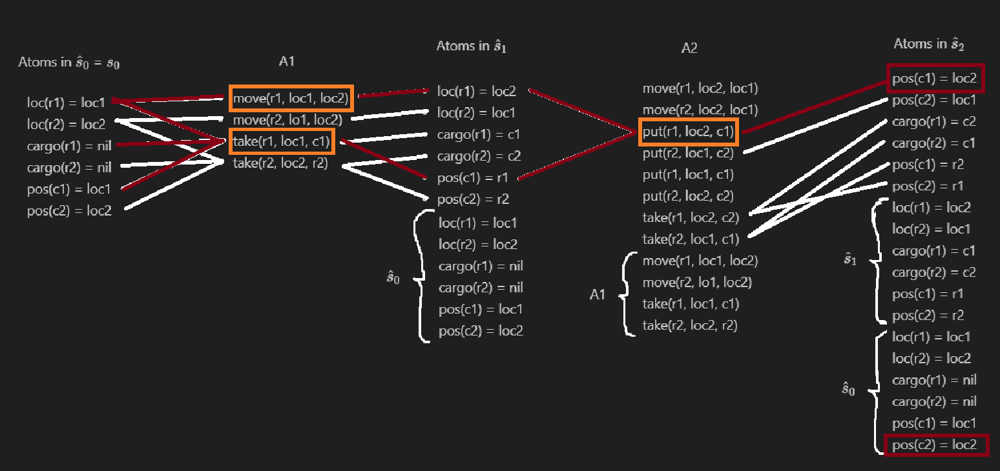

*Comecei a fazer apenas as precondições e efeitos relevantes a partir de $\hat{s}_1$, para o desenho ser legivel.*

Para voltar atrás só precisamos de ver por quantas ações passamos até atingirmos o nosso goal desde $\hat{s}_0$. E assim chegamos a que $h^{FF}(s_0) = 3$

## d)

queue <- { pos(c1) = loc2 } // só adicionamos isto à queue porque a outra landmark do goal já é cumprida por $s_0$.

queue = { ~~pos(c1) = loc2~~ }, Landmarks = { pos(c1) = loc2 }

R = { put(r1, loc2, c1), put(r2, loc2, c1) } // $s_0$ não satisfaz as precondições de nenhuma ação presente em R, por isso continuamos.

N = ?

$\hat{s}_0$
- loc(r1) = loc1
- loc(r2) = loc2
- cargo(r1) = nil
- cargo(r2) = nil
- pos(c1) = loc1
- pos(c2) = loc2

$A_1$ \ R
- move(r1, loc1, loc2)
- move(r2, loc2, loc1)
- take(r1, loc1, c1)
- take(r2, loc2, c2)

$\hat{s}_1$
- loc(r1) = loc2
- loc(r2) = loc1
- cargo(r1) = c1
- cargo(r2) = c2
- pos(c1) = r1
- pos(c2) = r2
- $\hat{s}_0$

$A_2$ \ R
- move(r1, loc2, loc1)
- move(r2, loc2, loc1)
- put(r2, loc1, c2)
- put(r1, loc1, c1)
- put(r2, loc2, c2)
- take(r1, loc2, c2)
- take(r2, loc1, c1)
- $A_1$ \ R

$\hat{s}_2$
- pos(c1) = loc2
- pos(c2) = loc1
- cargo(r1) = c2
- cargo(r2) = c1
- pos(c1) = r2
- pos(c2) = r1
- $\hat{s}_1$

$A_3$ \ R
- $A_2$ \ R

$\hat{s}_3$
- $\hat{s}_2$

Como $\hat{s}_2$ = $\hat{s}_3$, podemos parar e N = R = { put(r1, loc2, c1), put(r2, loc2, c1) }

Preconditions = { loc(r1) = loc2 /\ pos(c1) = r1 }, { loc1(r2) = loc2 /\ pos(c1) = r2 }

Q = Preconditions

L = { pos(c1) = loc2, loc(r1) = loc2 /\ pos(c1) = r1 }

R: { move(r1, loc1, loc2), take(r1, loc1, c1), take(r1, loc2, c1) }

R is satisfied by $s_0$ -> take(r1, loc1, c1)

$h^{sl}(s_0)$ = len(L) = 2

 

# 2.2.3

## a)

Precisamos de 4 ações, porque com apenas 2 não seria possível considerar o caso em que estamos a colocar e tirar os blocos da mesa.

## b)

Sim, porque sem essa variável seria impossível de garantir que só se pode pegar em um bloco de cada vez. Para além disso não saberiamos que bloco é que estamos a colocar sem essa variável.

## c)

Há 2 estados, um deles é o normal, chegando à solução pela maneira normal. O outro seria

s1 = { top(a) = b, top(b) = a, top(c) = nil, loc(a) = b, loc(b) = hand, loc(c) = table, holding = b }

Este estado é impossível de obter, mas acho que se consideram estados impossíveis.

 

# 2.2.5

start ---------------- finish
value(foo) = 1
value(bar) = 5
value(baz) = 0

## a)

A thread é que se $a_2$ vier antes de $a_1$ isso iria mudar o value(bar) para 1 e assim a precondition de $a_1$ não vai ser satisfeita. O resolver é remover a seta que vai do start até ao $a_2$ e criar uma seta desde $a_1$ até $a_2$.

## b)

Sim, uma execução possível seria:
- Criar $a_1$ para satisfazer o open goal value(foo) = 5, em finish.
- Criar $a_2$ para satisfazer o open goal value(bar) = 1, em finish.
- Criar um causal link com o efeito value(bar) = 5, em start, para o open goal value(bar) = 5, em $a_1$.

## c) + d)

Em teoria dá para ir infinitamente se ficarmos a stackar ações de forma a termos sempre um open goal.

## e)

Only one, the smaller.

## f) 

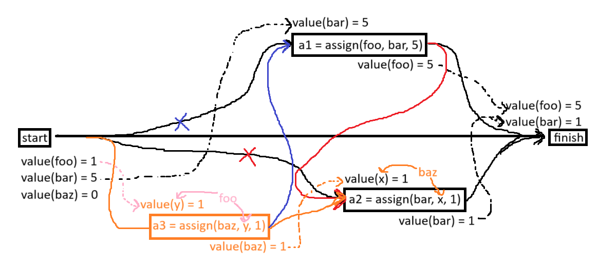

Seguindo a ordem: Vermelho, Laranja, Rosa, Azul